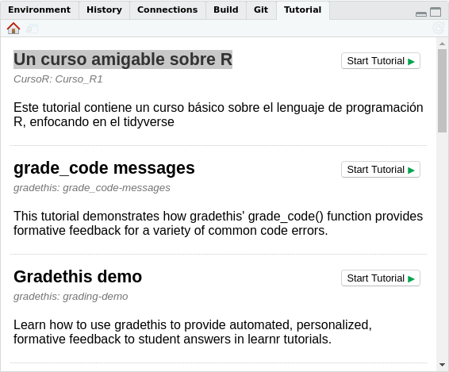

```{r, include = FALSE}
knitr::opts_chunk$set(
  collapse = TRUE,
  comment = "#>",
  fig.path = "man/figures/README-",
  out.width = "100%"
)
```

# Curso\_R 

[](https://www.repostatus.org/#active)

Este paquete contiene un curso amigable sobre R 

## Instalación

Puede instalar la última versión:

``` r
install.packages("remotes")
remotes::install_github("Duvancho321/Curso_R")
```

## Requisitos

Para ejecutar el curso debe contar con la última versión de los paquetes del tidyverse, para ello ejecute:

``` r
install.packages("tidyverse")
tidyverse::tidyverse_update()
```

Además deberá instalar los siguientes paquetes:

``` r
install.packages("rlang")
install.packages("learnr")
install.packages("showtext")
install.packages("patchwork")
install.packages("kableExtra")
remotes::install_github("garrettgman/DSR")
remotes::install_github("rstudio/fontawesome")
remotes::install_github("rstudio-education/gradethis")
remotes::install_github("allisonhorst/palmerpenguins")
```

## Recomendaciones

* En algunos casos el curso presenta inconvenientes con la última versión de R, se recomienda utilizar la versión 3.6.3

* En sistemas operativos diferentes de Linux, puede presentarse errores en la ejecución del curso, si tiene problemas le recomendamos utilizar [rcloud](https://rstudio.cloud/) con versión de R 3.6.3, puede registrarse con cuentas google o Github [Aquí](https://login.rstudio.cloud/register?redirect=https%3A%2F%2Fclient.login.rstudio.cloud%2Foauth%2Flogin%3Fshow_auth%3D0%26show_login%3D1%26show_setup%3D1)


## Guia de uso

* Para tener acceso al curso y trabajar con él debe ejecutar las siguientes líneas de código en R:

``` r
library(CursoR)
library(learnr)
```

``` r
learnr::run_tutorial("Curso_R1", package = "CursoR")
```

* Si cuenta con la última versión de Rstudio puede encontrar el curso como “Un curso amigable sobre R” en la sección de `Tutorial` y  ejecutarlo con un click en __Start Tutorial ▷__ 



## Sobre los autores

<div class="row">
  <div class="col-md-6" markdown="1">
  __Jorge Leonardo López Martínez__ es zootecnista con interés en el uso de la programación y la bioestadística aplicada al campo de la genética animal.
  <HR>
  <i class="fab fa-black-tie"></i> ⏼ [leo4luffy.github.io](https://leo4luffy.github.io/)<br>
  <i class="fas fa-envelope"></i> ✉ jollopezma@unal.edu.co<br>
  <i class="fa fa-github"></i> 	⌲ [Leo4Luffy](https://github.com/Leo4Luffy)
  </div>
  <div class="col-md-6" markdown="1">
  __Duvan Ariel Nieves Ruiz__ es estudiante de ingeniería ambiental apasionado por el software libre con interés en la ecología y la programación.
  <HR>
  <i class="fab fa-black-tie"></i>  ⏼ [duvancho321.github.io](https://duvancho321.github.io/)<br>
  <i class="fas fa-envelope"></i> ✉ dnieves@unal.edu.co<br>
  <i class="fa fa-github"></i> 	⌲ [Duvancho321](https://github.com/Duvancho321)
  </div>
</div>
