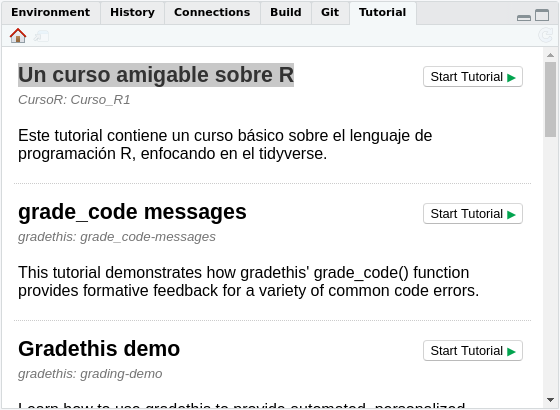

# Curso\_R 

[](https://www.repostatus.org/#active)

Este paquete contiene un curso amigable sobre R.

## Instalación

Puede instalar la última versión:

``` r
install.packages("remotes")
remotes::install_github("Duvancho321/Curso_R")
```

## Requisitos

Para ejecutar el curso debe contar con la última versión de los paquetes
del tidyverse. Para ello ejecute:

``` r
install.packages("tidyverse")
tidyverse::tidyverse_update()
```

Además deberá instalar los siguientes paquetes:

``` r
install.packages("rlang")
install.packages("learnr")
install.packages("showtext")
install.packages("patchwork")
install.packages("kableExtra")
remotes::install_github("garrettgman/DSR")
remotes::install_github("rstudio/fontawesome")
remotes::install_github("rstudio-education/gradethis")
remotes::install_github("allisonhorst/palmerpenguins")
```

## Recomendaciones

  - En algunos casos, el curso presenta inconvenientes con la última
    versión de R. Se recomienda utilizar la versión 3.6.3.

  - En sistemas operativos diferentes de Linux, puede presentarse
    errores en la ejecución del curso. Si tiene problemas, le
    recomendamos utilizar [rstudiocloud](https://rstudio.cloud/). Puede registrarse usando su cuenta de google o de GitHub
    [Aquí](https://login.rstudio.cloud/register?redirect=https%3A%2F%2Fclient.login.rstudio.cloud%2Foauth%2Flogin%3Fshow_auth%3D0%26show_login%3D1%26show_setup%3D1)

## Guia de uso

  - Para tener acceso al curso y trabajar con él debe ejecutar las
    siguientes líneas de código en R:

<!-- end list -->

``` r
library(CursoR)
library(learnr)
```

``` r
learnr::run_tutorial("Curso_R1", package = "CursoR")
```

  - Si cuenta con la última versión de RStudio, puede encontrar el curso
    como “Un curso amigable sobre R” en la sección de `Tutorial` y
    ejecutarlo con un click en **Start Tutorial ▷**



## Sobre los autores

| **Jorge Leonardo López Martínez** es zootecnista con interés en el uso de la programación y la bioestadística aplicada al campo de la genética animal. | **Duvan Ariel Nieves Ruiz** es estudiante de ingeniería ambiental apasionado por el software libre con interés en la ecología y la programación.|
| -------- | -------- |
|<i class="fab fa-black-tie"></i> ⏼ [leo4luffy.github.io](https://leo4luffy.github.io/) |<i class="fab fa-black-tie"></i> ⏼ [duvancho321.github.io](https://duvancho321.github.io/) |
|<i class="fas fa-envelope"></i> ✉ <jollopezma@unal.edu.co> | <i class="fas fa-envelope"></i> ✉ <dnieves@unal.edu.co><br> |
| <i class="fa fa-github"></i> ⌲ [Leo4Luffy](https://github.com/Leo4Luffy) | <i class="fa fa-github"></i> ⌲ [Duvancho321](https://github.com/Duvancho321) |

Tenga en cuenta que este curso está bajo la licencia <a rel="license" href="http://creativecommons.org/licenses/by-nc-sa/4.0/">Creative Commons Attribution-NonCommercial-ShareAlike 4.0 International License</a>. Por tanto el contenido del curso debe acreditarse a sus autores.

<section style="text-align: center;"><a rel="license" href="http://creativecommons.org/licenses/by-nc-sa/4.0/"></a><br/></section>
